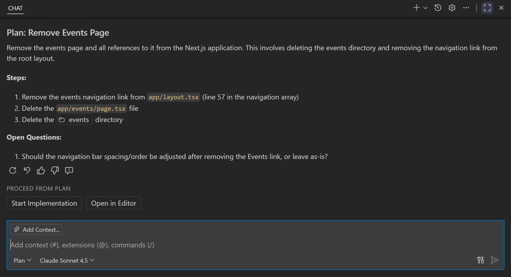

# **¿Cómo utilizo Copilot para escribir código?**

Mi forma de integrar la IA en el flujo de trabajo ha evolucionado principalmente con un objetivo claro: reducir la fricción entre el modelo y el contexto real del código. Con el tiempo, en función de las nuevas funcionalidades que cada IDE incorpora y de la capacidad de integrar modelos de IA directamente en el editor. Sin embargo, cada nueva característica introduce realmente una nueva manera de reducir el ciclo de copiar y pegar con el modelo y, en su lugar, permite que el modelo esté lo más cerca posible de aquello que queremos que logre.

Esta misma evolución la hemos visto dentro del propio ChatGPT, donde el flujo original consistía únicamente en una interfaz de chat. Si bien podías preguntarle al propio GPT sobre conocimiento general y el modelo respondía con cierto grado de precisión, cuando querías consultar elementos más específicos tenías que obtener datos de alguna fuente, pegarlos en la ventana de chat y, solo entonces, GPT podía ofrecer respuestas más acertadas.

Finalmente, el propio ChatGPT ha permitido hacer búsquedas en internet y cargar archivos y documentos. Incluso puede integrar apps (MCPs), lo que acerca aún más al modelo al contexto real de trabajo y anticipa el tipo de integración profunda que hoy ofrece Copilot dentro del IDE.

En este artículo nos vamos a enfocar en cómo utilizo GitHub Copilot, específicamente Copilot Chat integrado en un IDE como VS Code.

## Personalización

[Copilot Chat permite personalizar](https://docs.github.com/en/copilot/concepts/prompting/response-customization) las respuestas del modelo a nivel de organización, personal y de proyecto. En mi caso, me he enfocado principalmente en la personalización por proyecto, utilizando el archivo principal de configuración `github/copilot-instructions.md` y archivos individuales `*.instructions.md`.

Si bien un buen inicio es describir los detalles del proyecto de forma clara y detallada en el archivo `copilot-instructions.md`, me he topado con dos limitaciones importantes: a veces el archivo se vuelve demasiado grande y complejo, por lo que, según el modelo que estés implementando, puedes obtener respuestas de baja calidad causadas por romper la ventana de contexto. La segunda limitación es que, personalmente, suelo trabajar en proyectos con múltiples tecnologías, por lo que patrones que para mí aplican bien en, por ejemplo, JavaScript, no necesariamente aplican de igual forma en SQL, C#, etc.

Para mitigar estas limitaciones, me he enfocado en crear archivos de instrucciones con diferentes propósitos según el contexto del proyecto que estoy modificando. Esto significa que un proyecto puede tener distintas capas: en el backend puedes tener API, Controllers, Application Services, Domain, etc.; en el frontend, UI Components, State Managers, Pages, etc. Además, puedes tener pequeños submódulos o librerías con propósitos particulares, como una librería de encriptación o una librería de acceso a datos.

Entonces, cuando estoy trabajando en agregar, modificar o corregir código en mi proyecto, no siempre modifico todas las capas y módulos al mismo tiempo; siempre me enfoco en una parte muy específica. Ya sea que esté agregando un nuevo endpoint o incorporando lógica de negocio nueva, en ese caso, prefiero segmentar mis archivos de instrucciones según el segmento de código que estoy modificando.

```
my-project/
├─ backend/
│  ├─ api/
│  │  ├─ users/
│  │  │  └─ index.js
│  │  └─ auth/
│  │     └─ index.js
│  ├─ services/
│  │  └─ paymentService.js
│  └─ domain/
│     └─ order.js
├─ frontend/
│  ├─ components/
│  │  ├─ Button.js
│  │  └─ Header.js
│  └─ pages/
│     └─ checkout.js
├─ .github/
│  ├─ copilot-instructions.md
│  └─ instructions/
│     ├─ api-standard.instructions.md <- Instrucciones para endpoints de API RESTful
│     ├─ domain-entities.instructions.md <- Instrucciones para entidades de dominio
│     └─ ui-patterns.instructions.md <- Instrucciones para componentes UI
```

La clave está en definir el propósito de cada archivo de instrucciones y asegurarse de que tenga la longitud adecuada para que el modelo pueda aprovecharlo, previniendo romper la ventana de contexto mas frecuentemente. Esto puede requerir algo de prueba y error, ya que cargar demasiados archivos de instrucciones puede tener el mismo efecto que simplemente tener un archivo muy grande.

### Estandarización de patrones

Al inicio de la integration de Copilot Chat en mis equipos podia observar que bien, muchos developers resolvían actividades repetidas como escribir Tests y Documentation, si bien esto era un gran avance, aun podia ver como en los Code Reviews se seguían abordando temas relacionados con la estandarización de patrones y buenas prácticas.

En algún momento leí que *la calidad no es lo que predicas, es lo que toleras*. Esto me hizo reflexionar que, en los equipos y en las organizaciones, hay estándares y principios —que las personas hagan TDD, que sigan Clean Code, que documenten bien—, pero al final del día, si no hay una forma automatizada de hacer cumplir esos estándares, la calidad se diluye.

Para abordar este problema, la única forma de garantizar que los estándares se cumplan es automatizándolos. Existen muchas herramientas para hacer análisis estático de código, linters, formateadores, etc. Pero la parte más delicada llega cuando queremos garantizar que los patrones de diseño y las buenas prácticas se sigan en el código que se escribe día a día.

Aquí es donde los \*.instructions.md juegan un papel fundamental para hacer cumplir estos estándares, pues si puedes automatizar tests y documentación con Copilot, ¿por qué no automatizar acuerdos para escribir eventos, principios de programación, hacks internos del proyecto, etc.?

Es muy probable que tú o tu equipo utilicen algún recurso documental interno de principios, segundad en la organization u obtengan información de algún libro o artículo que hayan decidido adoptar como estándar. Finalmente, a través de MCPs o redactando instrucciones claras en archivos \*.instructions.md, puedes lograr que el modelo siga esos principios y patrones al momento de sugerir código.

Recientemente, un compañero me mostró [context7](https://context7.com/), al cual puedes acceder desde un MCP o simplemente copiar y pegar en algún archivo \*.md. Context7 se encarga de resumir repositorios, artículos, etc., en un formato amigable para que los modelos de lenguaje puedan aprovechar ese contexto adicional.


### Documentation accidental

Un estilo que he optado para redactar mis archivos para Copilot Chat es seguir un lenguaje natural, como si estuviera escribiendo documentación para que una persona la lea. Quizá esto sea algún antipatrón para escribir instrucciones para un LLM, pero me agrada que estos archivos no parezcan información digerida y mecánica.

En caso de relevar el proyecto a nuevos miembros del equipo, estos archivos pueden servir como documentación adicional para entender el propósito y las convenciones del proyecto, lo que facilita la incorporación de nuevos desarrolladores.

El beneficio de escribir archivos para Copilot Chat es inmediato: desde el primer prompt, inmediatamente después de refinar mis instrucciones, los resultados del modelo son de mayor calidad e, inmediatamente, otros compañeros del equipo se benefician de tener más y mejores módulos documentados.

## Construye tu agente base a ejemplos

La mejor forma que he encontrado para crear mis archivos es explicarlos paso a paso como si se los estuviera enseñando a un nuevo miembro del equipo. De hecho, en la práctica esto se ha vuelto habitual: cuando un compañero tiene una duda sobre un patrón o módulo del proyecto, iniciamos una sesión de pair programming, abro mi editor y comenzamos una nueva ventana de Copilot Chat.


El flujo consiste en ir pidiéndole a Copilot que me explique qué hace el módulo o componente que estoy revisando; a medida que Copilot genera la explicación, le doy feedback y le pido que mejore o agregue más detalles, hasta que la explicación quede clara y completa. Una vez que estoy satisfecho con la explicación, le pido que genere el archivo .md.


El resultado no siempre es perfecto, pero es un excelente punto de partida que puedo ajustar y mejorar rápidamente. Es necesario ponerlo en práctica e ir afinando los parámetros para que el modelo haga exactamente lo que necesitamos.

> El siguiente prompt lo genere y refine tal para escribir este artículo: [article-template-generator.prompt.md](../.github/prompts/article-template-generator.prompt.md). Ademas de generar aquel punto de partida usando Copilot Chat suelo apoyarme de este otro Custom GPT en ChatGTP para que aplique las mejores practicas de como suelo modelar mis .md files [Diseñador de Copilot Chat](https://chatgpt.com/g/g-68a7b356949c8191839aea1c9438e702-disenador-de-copilot-chat)

Extracto:

```
---
name: Article Template Generator
description: Generate a Markdown article template with frontmatter and a slug-based filename.
argument-hint: title="Article title" description="Short article description"
agent: agent
model: GPT-4.1 (copilot)
tools: ['edit']
---

Your task is to generate a Markdown article template.

## Steps

1. Ask the user for the **article title** if it is not provided.
2. Ask the user for a **short description** if it is not provided.
3. Generate a **slug** from the title using these rules:
   - Convert to lowercase
   - Remove accents and diacritics
   - Replace spaces with hyphens
   - Remove all characters except letters, numbers, and hyphens
4. Use the slug as the **file name**, ending with `.md`.
5. Generate the following Markdown content:
```

### Escribir agentes no es tan distinto de programar

Aun no es posible pedirle a ningún LLM que produzca el 100% del código respetando todos los estándares y patrones con un solo prompt.

> Haz un e-commerce.

Como siempre el *diablo* está en los detalles, y ahi es donde eso de ser un Ingeniero de Software se vuelve relevante. Uno como profesional debe entender el problema y conocer las posibles soluciones, las mas adecuadas o las que mejor se adaptan al contexto del proyecto.

Finalmente eso se traduce en pequeños módulos, en pasos, condicionales, iteraciones, etc. Tantos detalles que parece que tus prompts se ven como pseudocódigo. Si miras otra vez el ejemplo del prompt anterior, hay una serie de pasos que el agente debe seguir para llegar al resultado esperado, son exactamente los mismos pasos que uno como desarrollador seguiría para resolver el problema.

Las instrucciones se alinean al tren de pensamiento que uno como desarrollador debe seguir para resolver un problema.

## Spec-Driven Development

A la fecha hay dos recursos que me han motivado profundamente de seguir este camino de construir instrucciones y agentes para Copilot Chat.

El primer concepto fue [Spec-Driven Development](https://kiro.dev/docs/specs/concepts/) planteado en la documentation y la fundación del editor Kiro, en lugar de escribir código directamente, comienza por la especificación ahi uno como profesional describe el comportamiento esperado del código. Estas especificaciones sirven como una guía para que los modelos de lenguaje generen código que cumpla con los requisitos definidos.

Esto no es muy distinto de las practicas comunes en desarrollo de software como BDD (Behavior-Driven Development) o TDD (Test-Driven Development), donde uno define el comportamiento esperado del sistema antes de escribir el código.

Solo que la interfaz en este caso cambia, directamente es un manual de instrucciones para que el modelo pueda seguir y generar código acorde a esas especificaciones. Yo siguiendo el estilo mencionado previamente sobre escribir instrucciones como si fuera documentation para humanos, tiendo a llegar a un resultado que si bien no es el 100% perfecto, acelera la generación de código boilerplate, y me permite enfocarme en los detalles más complejos del problema.

Estos mismos "planes" o "specs" me han ayudado durante sesiones de Pair Programming con compañeros, donde juntos definimos el comportamiento esperado de un módulo o componente, y luego puedo delegar a otro programador la tarea de implementar ese módulo siguiendo las especificaciones definidas.

Originalmente construía mis planes siguiendo los pasos descritos en el segmento anterior; sin embargo, Copilot Chat ahora cuenta con un ["Plan Mode"](https://code.visualstudio.com/docs/copilot/chat/chat-planning) que permite iterar un tren de pensamiento antes de ejecutar cualquier cambio en el código, dándole al usuario la opción de aprobar o rechazar cada paso del plan.



El segundo recurso fue la publicación de [Anthropic, Disrupting the first reported AI-orchestrated cyber espionage campaign](https://www.anthropic.com/news/disrupting-AI-espionage), este narra atacantes usaban Claude Code para orquestar e inyectar ataques automáticos basados en agentes

El articulo es interesante, sin embargo lo mas impactante para mi fue el diagrama de flujo utilizado para explicar el proceso de ataque, pues estos no son mas que pipelines de instrucciones para que un agente pueda seguir y ejecutar una serie de pasos.

Nuevamente son los mismos principios de descomponer en pequeños instrucciones, las cuales se ejecutan de forma secuencial partiendo desde un objetivo general, las cuales pueden tener forma de agentes o prompts.


### Delegar tareas a un Agente

Dentro de la pirámide de abstracción que uno puede lograr con los LLMs, una de las capas más interesantes es la de delegar tareas a un agente. Esta no es una capacidad que yo haya utilizado aun, pero, en teoría, si tienes un conjunto de instrucciones claras y bien definidas, luego tienes especificaciones de alto nivel sobre como esta constituido un modulo, puedes delegar la tarea de implementar ese módulo a un agente, tal como el artículo de Anthropic describe.

Supongo que eventualmente cuando haga uso de esa funcionalidad estaré actualizando este articulo con mis experiencias.

## En conclusión

Los nuevos flujos de trabajo con IA desde la aparición de Copilot, GPT-3, etc., han evolucionado en una dirección que para mí se resume en: _cómo reducir el ciclo de copiar y pegar con el modelo y, en su lugar, permitir que el modelo esté lo más cerca posible de aquello que queremos que logre._

Escribir código con Copilot Chat es cada vez más parecido a simplemente escribir código de mejor calidad, ya que las buenas prácticas de toda la vida siguen siendo válidas: escribir código modular, reutilizable, documentado, testeado, etc. Al final, la IA solo logró que los ingenieros finalmente escribieran sus pruebas y documentación, segmentaran su tren de pensamiento en pasos claros y plasmaran todo eso en un recurso que cualquier persona pueda entender. Qué sorpresa, ¿no?
